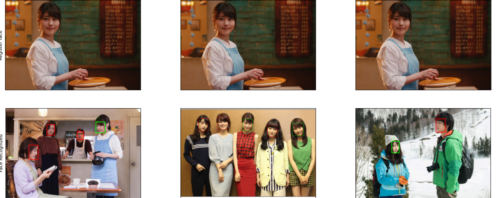
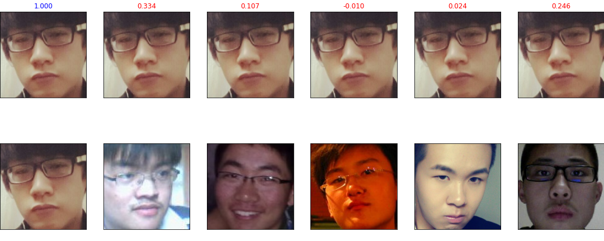

# 顔認証システムの実装  
---  
+ 登録人物の画像  
  
    
  
+ 認証結果  
  
  
  
---  
  
使い方:  
1. モデルをダウンロードして`./weights`に配置します  
[https://drive.google.com/file/d/1MWdnNZIXNHRBU1RyO1mcu4hl1EzW86VI/view?usp=sharing](https://drive.google.com/file/d/1MWdnNZIXNHRBU1RyO1mcu4hl1EzW86VI/view?usp=sharing)  
2. 自身の顔画像から特長量を作成してベクトル変換してから`./db`に保存します。  
```
$ python3 register.py img_path
```
3. 作成された特長量と新たな画像からの顔検知からの特長量の類似度を算出を算出する。結果として`./result`配下に画像が保存されます。緑の矩形は本人であることを示し、赤が別人物であることを指します。またオプションとして本人と検知される閾値を設定できます。これは認証を用いる環境によって変化するものです。ここではデフォルトとして低めな0.4を設定しました。    
```
$ python3 predict.py img_path threshold
```  

---  
  
注釈: モデルの開発は[ノートブックを参照](./notebook)  
モデルの学習過程での認証結果:  それぞれ上下間での類似度を算出しています。  
  
    
